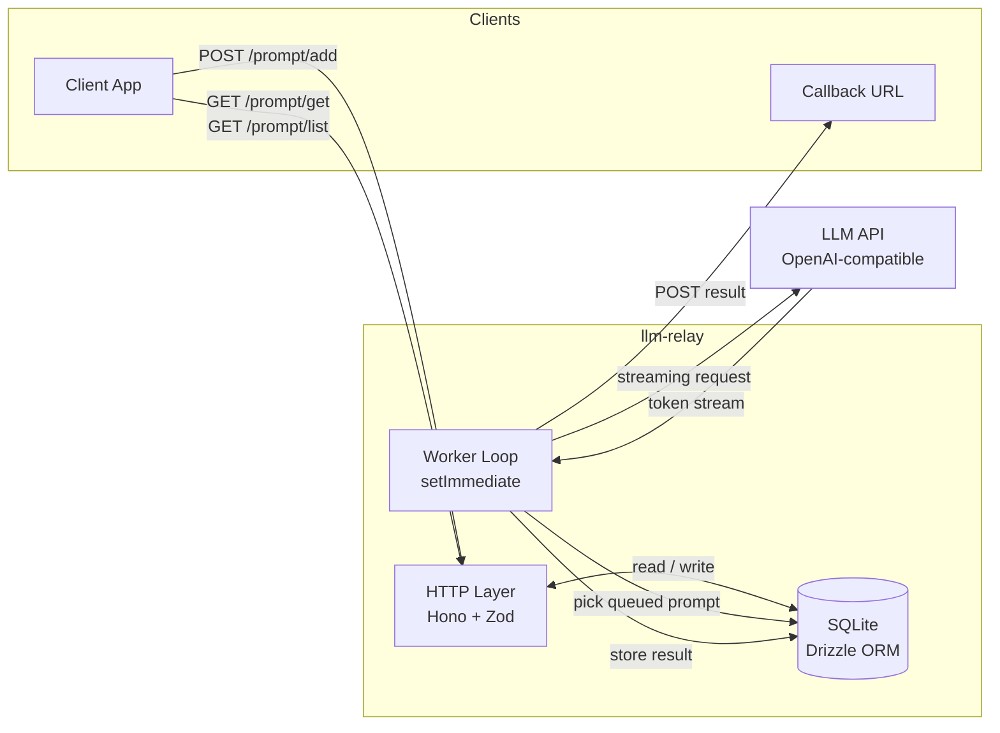

# Architecture

`llm-relay` is an HTTP relay that decouples clients from a single-threaded LLM backend. Clients enqueue prompts via REST; a worker loop processes them one at a time against an OpenAI-compatible API (e.g. Llama), persists results in SQLite, and optionally POSTs results back to a client-supplied callback URL.

## System Diagram



## Components

### HTTP Layer (`src/hono/`)

Hono-based REST API with Zod request validation. Routes are split by concern: prompt-specific routes live under `src/hono/prompt/`; cross-cutting routes (health, status, metrics, OpenAPI) sit directly under `src/hono/`. Bearer-token auth middleware is applied only to `/prompt/*` — monitoring endpoints are always public.

### Worker Loop (`src/index.ts` + `src/prompt/service.ts`)

A `setImmediate` loop with a 100 ms pause between iterations. Each tick:

1. Picks the highest-priority queued prompt (lowest `priority` value, FIFO on ties).
2. Streams the request to the upstream LLM API via the OpenAI SDK.
3. Stores the result and updates the prompt status (`completed`, `failed`, or `failed_retry`).
4. On the next pass, delivers pending callbacks (up to 50 per tick).

Failed prompts are retried with exponential backoff (`2^retryCount` seconds, capped at 60 s) until `OPENAI_MAX_RETRY_COUNT` is reached.

### Data Layer (`src/db/`)

SQLite via Drizzle ORM using Node.js's built-in `node:sqlite` module. The `prompts` table enforces a unique index on `(clientName, requestId)`. Schema changes require `npm run drizzle:push` (dev) or `drizzle:generate` + `drizzle:migrate` (prod).

Prompt lifecycle states:

```
queued → in_progress → completed
                     → failed
                     → failed_retry → in_progress → ...
```

### Shared Library (`src/lib/`)

- **`config.ts`** — environment variable parsing via `env-var`
- **`logger.ts`** — Pino structured JSON logger; every log includes a `component` field (`server`, `http`, `worker`, `callback`, `openai`)
- **`openAI.ts`** — OpenAI SDK streaming wrapper; resolves the model name once on first use, tracks reasoning vs response tokens separately, and emits timing metrics on completion
