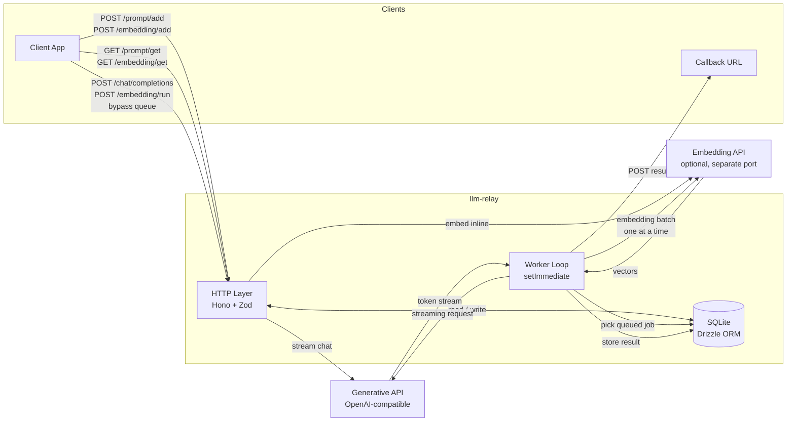

# Architecture

`llm-relay` is an HTTP relay that decouples clients from an LLM backend. Clients enqueue prompts via REST; a worker loop processes them against an OpenAI-compatible API (e.g. Llama), persists results in SQLite, and optionally POSTs results back to a client-supplied callback URL.

An optional **second backend** serves an embedding model — typically another llama.cpp instance on its own port. It runs the same queue, table shape and callback machinery, and is entirely absent when `EMBEDDING_URL` is unset.

## System Diagram


```mermaid
graph LR
    subgraph Clients
        C[Client App]
        CB[Callback URL]
    end

    subgraph llm-relay
        H[HTTP Layer\nHono + Zod]
        W[Worker Loop\nsetImmediate]
        DB[(SQLite\nDrizzle ORM)]
    end

    LLM[Generative API\nOpenAI-compatible]
    EMB[Embedding API\noptional, separate port]

    C -->|POST /prompt/add\nPOST /embedding/add| H
    C -->|GET /prompt/get\nGET /embedding/get| H
    C -->|POST /chat/completions\nPOST /embedding/run\nbypass queue| H
    H <-->|read / write| DB
    H -->|stream chat| LLM
    H -->|embed inline| EMB
    W -->|pick queued job| DB
    W -->|streaming request| LLM
    W -->|embedding batch\none at a time| EMB
    LLM -->|token stream| W
    EMB -->|vectors| W
    W -->|store result| DB
    W -->|POST result| CB
```

## Components

### HTTP Layer (`src/hono/`)

Hono-based REST API with Zod request validation. Routes are split by concern: prompt-specific routes live under `src/hono/prompt/`; embedding routes under `src/hono/embedding/`; chat routes under `src/hono/chat/`; cross-cutting routes (health, status, metrics, OpenAPI) sit directly under `src/hono/`. Bearer-token auth middleware is applied to `/prompt/*`, `/chat/*` and `/embedding/*` — monitoring endpoints are always public.

`POST /chat/completions` is a direct streaming path that bypasses the queue entirely: it calls `streamChatCompletion` in `generative.ts`, pipes the SSE chunks straight to the client, and propagates the client's abort signal to cancel the upstream request on disconnect. `POST /embedding/run` is its embedding counterpart, minus the streaming.

`src/hono/embedding/index.ts` mounts a guard middleware ahead of every embedding route that answers `503` when `config.embedding` is undefined, so an unconfigured relay reports "not enabled here" rather than 404-ing or half-working.

Request schemas live in `src/hono/prompt/schemas.ts` (and `src/lib/chatSchemas.ts` for chat) rather than in the route files, so `src/hono/openapi.ts` can generate `GET /openapi.json` from the same Zod objects the routes validate with (`z.toJSONSchema`) — the spec cannot drift from what is enforced. Error responses go through the single `jsonError` helper in `src/hono/errors.ts`.

`GET /metrics` returns Prometheus text-format output combining prompt-queue gauges with request-level counters/histograms — see [Shared Library](#shared-library-srclib) below.

### Worker Loop (`src/index.ts` + `src/prompt/service.ts` + `src/embedding/service.ts`)

Kicked off with `setImmediate`, then re-scheduled with a 100 ms `setTimeout` after each iteration. Each tick runs four jobs concurrently — they touch disjoint tables, so none can stall another:

1. Picks up to `WORKER_CONCURRENCY` (default `1`) highest-priority queued prompts (lowest `priority` value, FIFO on ties), marks them all `in_progress`, streams them to the generative API **concurrently**, and stores each result.
2. Delivers pending prompt callbacks (up to 50 per tick, at most 10 in flight).
3. Picks up to `WORKER_CONCURRENCY` queued embedding jobs and runs them **serially** — embedding backends typically run with `--parallel 1`, so overlapping requests would only queue inside the backend where the relay cannot see or time them.
4. Delivers pending embedding callbacks, same batching.

Failed jobs are retried with exponential backoff (`2^retryCount` seconds, capped at 60 s) until `UPSTREAM_MAX_RETRY_COUNT` is reached. Only network-shaped failures count as transient; an upstream rejecting the request itself (bad input, an embedding input exceeding the backend's `--ctx-size`, a GPU out-of-memory `Compute error`) goes terminal on the first attempt, since it would fail identically every time.

### Data Layer (`src/db/`)

SQLite via Drizzle ORM using Node.js's built-in `node:sqlite` module. The `prompts` and `embeddings` tables each enforce a unique index on `(clientName, requestId)` — separate tables, so the two queues never share a key namespace. Schema changes require `npm run drizzle:push` (dev) or `drizzle:generate` + `drizzle:migrate` (prod); on startup `src/index.ts` applies the generated migrations from `./drizzle` before the port opens, so that folder must ship alongside `dist/`.

`schema.ts` is the single source of truth for both enums — `JOB_STATUSES` (aliased as `PROMPT_STATUSES` / `EMBEDDING_STATUSES`) and `ENCODING_FORMATS`. The Drizzle columns, the Zod request schemas, and the OpenAPI enums all derive from them. `errors.ts` provides `isUniqueConstraintError`, which walks the `cause` chain of a `DrizzleQueryError` down to the underlying `node:sqlite` error so the `add` routes can turn a duplicate key into a `409`.

The `embeddings.vectors` column is a single contiguous little-endian **float32 blob** holding `inputCount × dimensions` values, sliced back on read. Embedding backends emit float32 and pgvector's `vector` type is float32, so a JSON array would have stored only padding at roughly 5× the size — at 2560 dimensions that is 10 KB per vector rather than ~50 KB.

Job lifecycle states (shared by both tables):

```
queued → in_progress → completed
                     → failed
                     → failed_retry → in_progress → ...
```

### Shared Library (`src/lib/`)

All modules are re-exported through the `src/lib/index.ts` barrel; other layers import from `@lib` rather than reaching past it.

- **`config.ts`** — environment variable parsing via `env-var`, validated at startup (out-of-range values throw rather than silently clamping)
- **`logger.ts`** — Pino structured JSON logger; every log includes a `component` field (`server`, `http`, `worker`, `callback`, `generative`, `embedding`, `chat`)
- **`callbackUrl.ts`** — `isCallbackUrlAllowed` (regex check against `CALLBACK_URL_ALLOWLIST`, the SSRF guard used inside the `POST /prompt/add` Zod schema) and `checkCallbackAvailability` (5 s `HEAD` probe; passes on 2xx, or `405`/`501` where the host is reachable but does not implement `HEAD`)
- **`chatSchemas.ts`** — Zod schemas for `POST /chat/completions` request bodies. They live here rather than in `src/hono/` so `@lib` never depends on the HTTP layer; `src/hono/chat/schemas.ts` re-exports them
- **`modelInfo.ts`** — `createModelResolver(component, getConfig)` builds one independently TTL-cached `/models` resolver plus health probe per upstream. The cache timestamp is stamped at promise _creation_, so concurrent callers racing the first lookup share one in-flight request instead of each firing their own; it re-resolves every `UPSTREAM_MODEL_CACHE_TTL_SECONDS` (default 60 s) so a backend restart with a different model is picked up without restarting the relay. The config is read through a thunk rather than captured, so a reassigned config still takes effect
- **`generative.ts`** — OpenAI SDK streaming wrapper for the chat backend. Exports `executeGenerativePrompt` (used by the worker — accumulates the full response, tracks reasoning vs response tokens separately, emits timing metrics on completion), `streamChatCompletion` (used by `POST /chat/completions` — yields raw SSE chunks directly to the caller), `getGenerativeModelInfo` and `checkGenerative`
- **`embedding.ts`** — the embedding backend's counterpart. The `OpenAI` client is built lazily, since `config.embedding` is absent whenever the feature is off and constructing it at import time would make the module unloadable. `executeEmbedding` requests `encoding_format: 'base64'` to save the upstream serialising ~2500 floats per vector as JSON text, then normalises whichever shape comes back
- **`vectors.ts`** — float32 pack/unpack/encode, kept separate so it is trivially unit-testable. `normaliseUpstreamEmbedding` absorbs the fact that base64 support varies by llama.cpp build, so requesting it upstream stays an internal optimisation rather than a client-visible contract
- **`jobs.ts`** — the queue machinery shared by both workers: `computeNextRetryAt`, `isTransientError`, `buildCallbackHeaders` (HMAC signing) and `deliverJobCallback`. Marking a row delivered stays with the caller, since only it knows which table to touch. Adding a third queue (rerank, say) needs no refactor here
- **`metrics.ts`** — dependency-free in-process Prometheus registry (`incCounter`, `setGauge`, `observeHistogram`, `renderMetrics`) used to back `GET /metrics`. The `httpMetrics` middleware (`src/hono/httpMetrics.ts` — skips monitoring routes like `/health`, `/status`, `/metrics` themselves), the prompt worker's generative call, the `/chat/completions` stream, the embedding worker, `/embedding/run`, and callback delivery each record into it, producing `http_requests_total`/`http_request_duration_seconds`, `generative_requests_total`/`generative_request_duration_seconds`, `generative_chat_requests_total`/`generative_chat_request_duration_seconds`, `embedding_requests_total`/`embedding_request_duration_seconds`, `embedding_run_requests_total`/`embedding_run_request_duration_seconds`, and `callback_deliveries_total`. The `llm_relay_*` queue gauges go through the same registry via `setGauge`, so `GET /metrics` has a single exposition-format implementation
