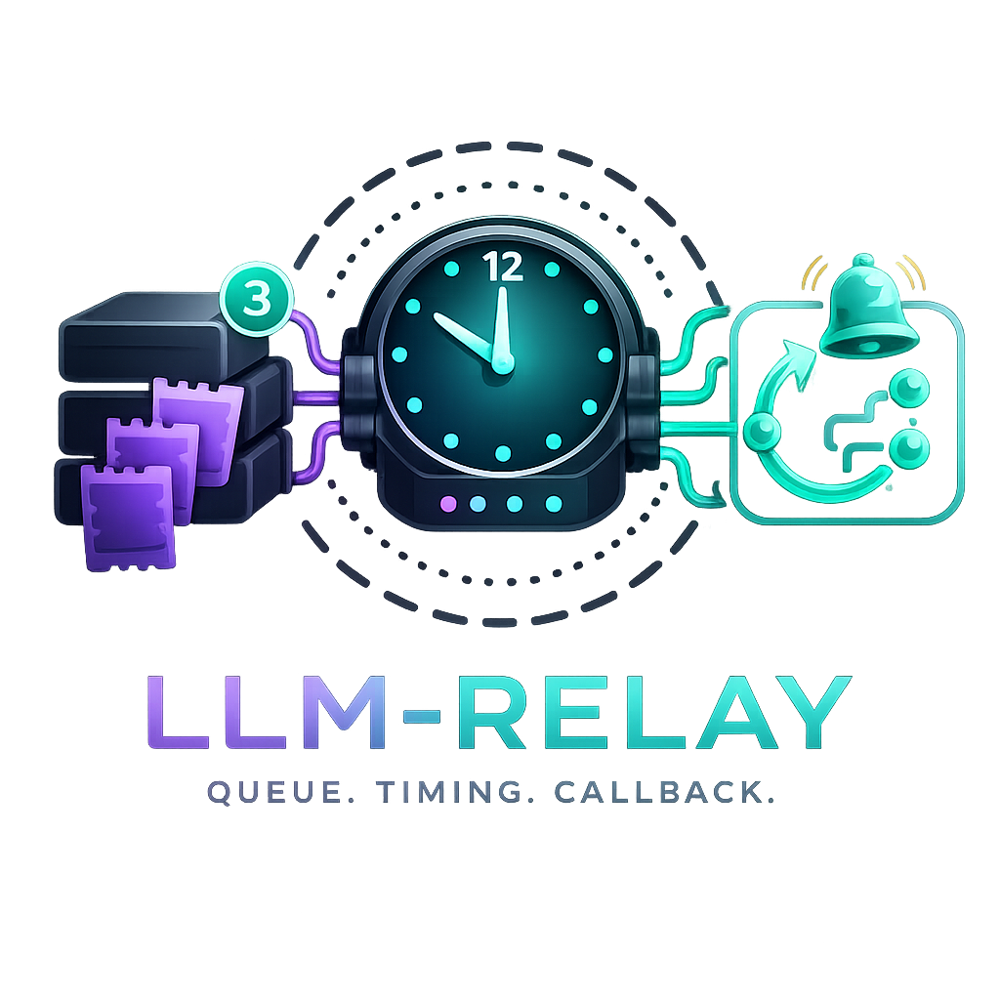

# LLM-relay

An HTTP relay server that queues LLM prompts, executes them serially against any OpenAI-compatible API, and optionally delivers results to a callback URL.

[Changelog](CHANGELOG.md)

<p align="center">
  
</p>

---

## Why

Local or self-hosted LLMs (e.g. llama.cpp, Ollama, vLLM) typically handle only a few requests at a time. `llm-relay` sits in front of the model and serializes concurrent requests into a FIFO queue backed by SQLite, so callers never have to manage back-pressure themselves. Clients can either poll for results or receive them via a push callback.

## Infrastructure requirements

- **Node.js** 24+ (ESM, top-level `await`)
- **An OpenAI-compatible API** — any endpoint that implements `GET /models` and `POST /chat/completions` with streaming (llama.cpp server, Ollama, vLLM, LM Studio, the real OpenAI, etc.)
- **SQLite** — no separate database process needed; the file is created automatically on first run

## Setup

```bash
npm install
cp .env.example .env   # then edit .env
```

### Environment variables

| Variable            | Default                    | Description                                                         |
| ------------------- | -------------------------- | ------------------------------------------------------------------- |
| `PORT`              | `3000`                     | HTTP port the relay listens on                                      |
| `LOG_LEVEL`         | `info`                     | Pino log level (`trace`, `debug`, `info`, `warn`, `error`)          |
| `DATABASE_FILENAME` | `./database.sqlite`        | Path to the SQLite database file                                    |
| `OPENAI_URL`        | `http://localhost:8080/v1` | Base URL of the OpenAI-compatible API                               |
| `OPENAI_MODEL`      | _(first available model)_  | Model name to use; if empty, the first model from `/models` is used |
| `OPENAI_KEY`        | `none`                     | API key (use `none` for local servers that don't require one)       |
| `OPENAI_TIMEOUT`    | `10000`                    | Per-request timeout in milliseconds                                 |

## Running

```bash
# Development (auto-reload, pretty logs)
npm run dev

# Production
npm run build
npm start
```

## Logs

`llm-relay` uses [Pino](https://github.com/pinojs/pino) structured JSON logging. Every log entry includes a `component` field:

| `component` | Source                                                        |
| ----------- | ------------------------------------------------------------- |
| `server`    | Startup, shutdown, unhandled worker errors                    |
| `http`      | Per-request logs from the Hono middleware (debug only)        |
| `worker`    | Prompt lifecycle — picked up, completed, failed               |
| `callback`  | Callback delivery — sent, failed                              |
| `openai`    | Model resolution, prompt send, completion with timing metrics |

At the default `info` level you see lifecycle events (one log per prompt through its lifecycle). Set `LOG_LEVEL=debug` to also get per-request HTTP logs and the prompt pick-up event.

The `openai` completion log includes inference performance metrics useful for monitoring throughput:

```json
{
  "component": "openai",
  "model": "llama-3.2",
  "reasoningTimeMs": 1240,
  "reasoningTokenPerSecond": 48,
  "responseTimeMs": 320,
  "responseTokenPerSecond": 54,
  "msg": "Prompt completed"
}
```

## Production deployment

### Docker

Images are published to GitHub Container Registry as `ghcr.io/ai-colony/llm-relay:1.2.1`.

Minimal — only the upstream URL needs to be set; everything else has a sensible default:

```bash
docker run -d --rm \
  --name llm-relay \
  -p 3000:3000 \
  -e OPENAI_URL=http://host.docker.internal:8080/v1 \
  -v llm-relay-data:/app/data \
  ghcr.io/ai-colony/llm-relay:1.2.1
```

Full — all available environment variables:

```bash
docker run -d --rm \
  --name llm-relay \
  -p 3000:3000 \
  -e PORT=3000 \
  -e LOG_LEVEL=info \
  -e OPENAI_URL=http://host.docker.internal:8080/v1 \
  -e OPENAI_MODEL= \
  -e OPENAI_KEY=none \
  -e OPENAI_TIMEOUT=10000 \
  -v llm-relay-data:/app/data \
  ghcr.io/ai-colony/llm-relay:1.2.1
```

Key points:

- **SQLite path**: the database lives at `/app/data/database.sqlite` — pre-configured in the image, no env var needed. Always mount a named volume or host directory at `/app/data` so data survives container restarts.
- **`--rm`**: removes the stopped container automatically; the named volume `llm-relay-data` is unaffected, so your data is safe.
- **Network**: uses `host.docker.internal` to reach a local LLM server. On Linux with bridge networking replace it with the host gateway IP, or use `--network host` and `OPENAI_URL=http://localhost:8080/v1` instead.
- **Port**: the relay listens on `PORT` (default `3000`). The `-p 3000:3000` flag exposes it from the container.

#### docker compose

```bash
# Copy and edit the compose environment, then:
docker compose up -d
```

The bundled `docker-compose.yml` uses `host.docker.internal` as the upstream host so it works on Docker Desktop (Mac/Windows). On Linux with bridge networking replace it with the host gateway IP, or switch the service to `network_mode: host`.

#### npm helper scripts

```bash
npm run docker:build   # build image tagged llm-relay:<version>
npm run docker:run     # run with --network=host and llm-relay-data volume
npm run docker:it      # interactive shell in a fresh container
```

These scripts read `OPENAI_*` and other variables from `.env.docker` (create it from `.env.example`).

### From source

Service definition files for Linux (systemd) and macOS (launchd) live in `infra/`.

```bash
git clone https://github.com/BCsabaEngine/llm-relay /opt/llm-relay
cd /opt/llm-relay
npm ci --omit=dev
npm run build
cp .env.example .env   # then edit .env
```

### Linux — systemd

```bash
# Create a dedicated system user
sudo useradd --system --no-create-home llm-relay

# Install the unit file (substitute the actual install path)
sed "s|/opt/llm-relay|$(pwd)|g" infra/llm-relay.service \
  | sudo tee /etc/systemd/system/llm-relay.service

sudo systemctl daemon-reload
sudo systemctl enable --now llm-relay

# Follow logs
journalctl -u llm-relay -f
```

### macOS — launchd

```bash
# Create the log directory
sudo mkdir -p /var/log/llm-relay

# Install the plist (substitute the actual install path)
sed "s|/opt/llm-relay|$(pwd)|g" infra/com.llm-relay.plist \
  | sudo tee /Library/LaunchDaemons/com.llm-relay.plist

sudo launchctl load -w /Library/LaunchDaemons/com.llm-relay.plist

# Follow logs
tail -f /var/log/llm-relay/llm-relay.log
```

### Update

```bash
./infra/update.sh

# then restart:
sudo systemctl restart llm-relay                      # Linux
sudo launchctl kickstart -k system/com.llm-relay      # macOS
```

## API

All requests and responses use JSON. An interactive OpenAPI reference is available at `GET /docs` (Swagger UI); the raw schema is at `GET /openapi.json`.

### `GET /health`

Returns `200 OK` when both the SQLite database and the upstream OpenAI endpoint are reachable. Returns `503` if either check fails, with a `checks` object describing which component is down.

### `GET /status`

Returns queue counts and server uptime.

```json
{
  "version": "1.2.1",
  "uptime": 42,
  "queued": 3,
  "pending": 1,
  "completed": 150,
  "failed": 2,
  "callbackPending": 0
}
```

```typescript
import { z } from 'zod';

const StatusResponse = z.object({
  version: z.string(),
  uptime: z.number(),
  queued: z.number().int(),
  pending: z.number().int(),
  completed: z.number().int(),
  failed: z.number().int(),
  callbackPending: z.number().int()
});
type StatusResponse = z.infer<typeof StatusResponse>;
```

### `POST /prompt/add`

Enqueue a prompt. The `(clientName, requestId)` pair must be unique — re-submitting the same pair returns `409` unless `overwrite` is set to `true`.

**Request body:**

```json
{
  "clientName": "my-app",
  "requestId": 1,
  "userPrompt": "What is the capital of France?",
  "systemPrompt": "You are a geography expert.",
  "temperature": 0.7,
  "callbackUrl": "https://my-app.example.com/llm-callback",
  "overwrite": false
}
```

| Field          | Type    | Required | Description                                                                                                                                                                                                                                      |
| -------------- | ------- | -------- | ------------------------------------------------------------------------------------------------------------------------------------------------------------------------------------------------------------------------------------------------ |
| `clientName`   | string  | yes      | Logical client identifier; scopes `requestId` uniqueness                                                                                                                                                                                         |
| `requestId`    | integer | yes      | Client-assigned ID, positive integer                                                                                                                                                                                                             |
| `userPrompt`   | string  | yes      | The user turn of the conversation                                                                                                                                                                                                                |
| `systemPrompt` | string  | no       | Optional system prompt                                                                                                                                                                                                                           |
| `temperature`  | float   | yes      | Sampling temperature, `0`–`2`                                                                                                                                                                                                                    |
| `callbackUrl`  | URL     | no       | If provided, the relay POSTs the result here when done                                                                                                                                                                                           |
| `overwrite`    | boolean | no       | Default `false`. When `true`, deletes any existing prompt with the same `clientName + requestId` before adding. Only valid for statuses `queued`, `completed`, `failed`, `failed_retry` — returns `409` if the existing prompt is `in_progress`. |

```typescript
import { z } from 'zod';

const AddPromptBody = z.object({
  clientName: z.string().min(1),
  requestId: z.number().int().positive(),
  userPrompt: z.string().min(1),
  systemPrompt: z.string().optional(),
  temperature: z.number().min(0).max(2),
  callbackUrl: z.string().url().optional(),
  overwrite: z.boolean().optional().default(false)
});
type AddPromptBody = z.infer<typeof AddPromptBody>;
```

**Response `201`:**

```json
{ "success": true, "queued": 4 }
```

```typescript
const AddPromptResponse = z.object({
  success: z.literal(true),
  queued: z.number().int()
});
type AddPromptResponse = z.infer<typeof AddPromptResponse>;
```

### `GET /prompt/get?clientName=&requestId=`

Poll for the result of a specific prompt.

```typescript
import { z } from 'zod';

const GetPromptQuery = z.object({
  clientName: z.string(),
  requestId: z.coerce.number().int().positive()
});
type GetPromptQuery = z.infer<typeof GetPromptQuery>;
```

**Response when completed:**

```json
{
  "status": "completed",
  "reasoning": "...",
  "response": "Paris.",
  "reasoningTimeMs": 1200,
  "reasoningTokenPerSecond": 45,
  "responseTimeMs": 300,
  "responseTokenPerSecond": 52
}
```

**Response when still processing:**

```json
{ "status": "queued" }
```

**Response on failure:**

```json
{ "status": "failed", "statusError": "ECONNRESET" }
```

**Response `404` — prompt not found:**

```json
{ "success": false, "error": "Prompt not found" }
```

```typescript
const GetPromptResponse = z.discriminatedUnion('status', [
  z.object({ status: z.enum(['queued', 'in_progress', 'failed_retry']) }),
  z.object({ status: z.literal('failed'), statusError: z.string().nullable() }),
  z.object({
    status: z.literal('completed'),
    reasoning: z.string().nullable(),
    response: z.string().nullable(),
    reasoningTimeMs: z.number().nullable(),
    reasoningTokenPerSecond: z.number().nullable(),
    responseTimeMs: z.number().nullable(),
    responseTokenPerSecond: z.number().nullable()
  })
]);
type GetPromptResponse = z.infer<typeof GetPromptResponse>;
```

### `GET /prompt/list?clientName=&status=`

List all prompts for a client. `status` filter is optional and accepts: `queued`, `in_progress`, `completed`, `failed`, `failed_retry`. Results are capped at 500 records.

```typescript
import { z } from 'zod';

const PromptStatus = z.enum(['queued', 'in_progress', 'completed', 'failed', 'failed_retry']);

const ListPromptsQuery = z.object({
  clientName: z.string(),
  status: PromptStatus.optional()
});
type ListPromptsQuery = z.infer<typeof ListPromptsQuery>;

const ListPromptsResponse = z.array(
  z.object({
    id: z.number().int(),
    clientName: z.string(),
    requestId: z.number().int(),
    status: PromptStatus,
    statusError: z.string().nullable(),
    createdAt: z.coerce.date(),
    completedAt: z.coerce.date().nullable(),
    callbackUrl: z.string().url().nullable(),
    callbackCompleted: z.boolean(),
    systemPrompt: z.string().nullable(),
    userPrompt: z.string(),
    temperature: z.number(),
    retryCount: z.number().int(),
    nextRetryAt: z.coerce.date().nullable(),
    reasoning: z.string().nullable(),
    response: z.string().nullable(),
    reasoningTimeMs: z.number().nullable(),
    reasoningTokenPerSecond: z.number().nullable(),
    responseTimeMs: z.number().nullable(),
    responseTokenPerSecond: z.number().nullable()
  })
);
type ListPromptsResponse = z.infer<typeof ListPromptsResponse>;
```

### `DELETE /prompt/cancel?clientName=&requestId=`

Cancel and **delete** a prompt. Only succeeds for `queued`, `failed`, and `failed_retry` statuses — returns `409` if the prompt is `in_progress` or already `completed`.

```typescript
import { z } from 'zod';

const CancelPromptQuery = z.object({
  clientName: z.string(),
  requestId: z.coerce.number().int().positive()
});
type CancelPromptQuery = z.infer<typeof CancelPromptQuery>;

const CancelPromptResponse = z.object({
  success: z.literal(true)
});
type CancelPromptResponse = z.infer<typeof CancelPromptResponse>;
```

## Prompt lifecycle

```
queued → in_progress → completed
                     → failed          (terminal)
                     → failed_retry    (re-queued, retried indefinitely)
```

Transient errors (network timeouts, connection resets, `AbortError`, etc.) trigger `failed_retry` with an exponential backoff delay (`2^retryCount × 1 s`, capped at 60 s). There is no retry limit — transient errors are retried indefinitely. Hard failures (e.g. model not found) go straight to `failed`.

On startup, any prompts stuck in `in_progress` from a previous unclean shutdown are automatically reset to `queued`.

## Callback delivery

When a prompt with a `callbackUrl` completes, the relay POSTs the following payload to that URL (10 s timeout):

```json
{
  "clientName": "my-app",
  "requestId": 1,
  "reasoning": "...",
  "response": "Paris."
}
```

Callback delivery is tracked separately from prompt completion — a failed HTTP POST is logged and retried on the next worker tick (up to 50 callbacks per tick, FIFO order). There is no retry limit; failed deliveries are retried indefinitely.

```typescript
import { z } from 'zod';

const CallbackPayload = z.object({
  clientName: z.string(),
  requestId: z.number().int(),
  reasoning: z.string().nullable(),
  response: z.string().nullable()
});
type CallbackPayload = z.infer<typeof CallbackPayload>;
```

## Usage example

```bash
# 1. Enqueue a prompt
curl -s -X POST http://localhost:3000/prompt/add \
  -H 'Content-Type: application/json' \
  -d '{
    "clientName": "demo",
    "requestId": 1,
    "userPrompt": "Name three planets.",
    "temperature": 0.5
  }'
# → {"success":true,"queued":1}

# 2. Poll until completed
curl -s 'http://localhost:3000/prompt/get?clientName=demo&requestId=1'
# → {"status":"queued"}
# ... wait a moment ...
curl -s 'http://localhost:3000/prompt/get?clientName=demo&requestId=1'
# → {"status":"completed","reasoning":null,"response":"Mercury, Venus, Earth.","reasoningTimeMs":null,...}

# 3. Check server status
curl -s http://localhost:3000/status
```
