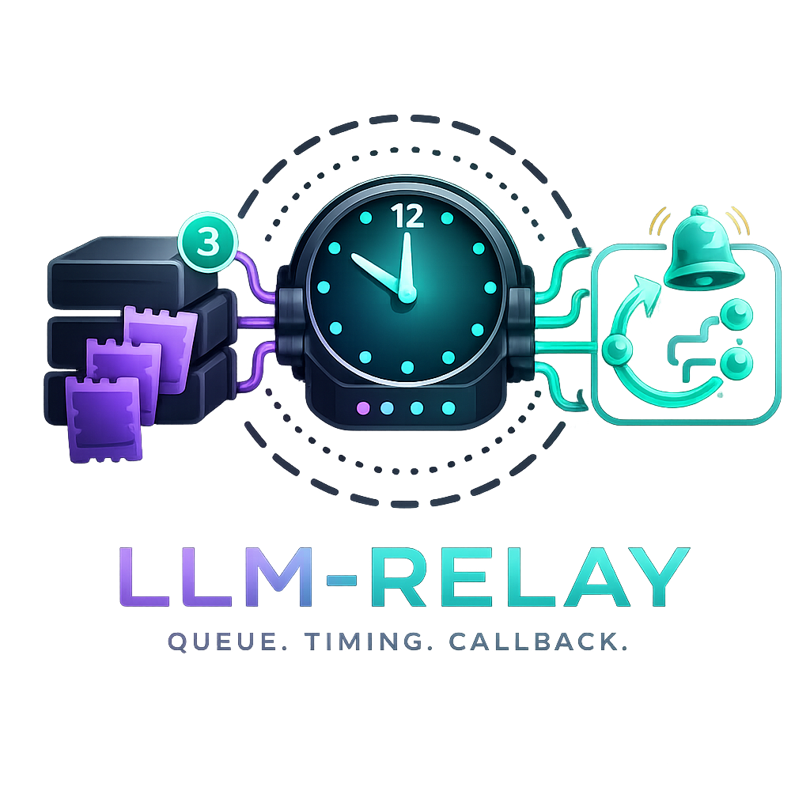

# LLM-relay

An HTTP relay server that queues LLM prompts, executes them against any OpenAI-compatible API (serially by default, or `WORKER_CONCURRENCY` at a time), and optionally delivers results to a callback URL. An optional second backend adds the same queue for embeddings.

[Changelog](CHANGELOG.md) · [Architecture](ARCHITECTURE.md) · [llama.cpp setup](LLAMA-SERVER.md)

<p align="center">
  
</p>

---

## Why

Local or self-hosted LLMs (e.g. llama.cpp, Ollama, vLLM) typically handle only a few requests at a time. `llm-relay` sits in front of the model and serializes concurrent requests into a priority queue backed by SQLite, so callers never have to manage back-pressure themselves. Clients can either poll for results or receive them via a push callback.

## Infrastructure requirements

- **Node.js** 24 (ESM, top-level `await`)
- **An OpenAI-compatible API** — any endpoint that implements `GET /models` and `POST /chat/completions` with streaming (llama.cpp server, Ollama, vLLM, LM Studio, the real OpenAI, etc.)
- **Optionally, a second OpenAI-compatible endpoint serving an embedding model** — needs `GET /models` and `POST /embeddings`. Typically a separate llama.cpp instance started with `--embedding` on its own port. Omit it and embedding support simply stays off. Running both models on one machine needs their context sizes tuned so they fit in GPU memory together — see [LLAMA-SERVER.md](LLAMA-SERVER.md).
- **SQLite** — no separate database process needed; the file is created automatically on first run

## Setup

```bash
npm install
cp .env.example .env   # then edit .env
```

### Environment variables

| Variable                           | Default                    | Description                                                                                                                                                                                                                |
| ---------------------------------- | -------------------------- | -------------------------------------------------------------------------------------------------------------------------------------------------------------------------------------------------------------------------- |
| `PORT`                             | `3000`                     | HTTP port the relay listens on                                                                                                                                                                                             |
| `API_KEY`                          | _(empty)_                  | When set, all `/prompt/*`, `/chat/*` and `/embedding/*` endpoints require `Authorization: Bearer <key>`. `GET /health`, `GET /status`, `GET /metrics`, `GET /openapi.json`, and `GET /docs` remain public.                 |
| `LOG_LEVEL`                        | `info`                     | Pino log level (`trace`, `debug`, `info`, `warn`, `error`, `fatal`)                                                                                                                                                        |
| `DATABASE_FILENAME`                | `./database.sqlite`        | Path to the SQLite database file                                                                                                                                                                                           |
| `GENERATIVE_URL`                   | `http://localhost:8080/v1` | Base URL of the generative (chat) OpenAI-compatible API                                                                                                                                                                    |
| `GENERATIVE_MODEL`                 | _(first available model)_  | Model name to use; if empty, the first model from `/models` is used                                                                                                                                                        |
| `GENERATIVE_KEY`                   | `none`                     | API key (use `none` for local servers that don't require one)                                                                                                                                                              |
| `EMBEDDING_URL`                    | _(empty)_                  | Base URL of an optional second, embedding-only backend. **Leave empty to disable embedding support entirely** — `/embedding/*` then answers `503` and `/health` ignores it.                                                |
| `EMBEDDING_MODEL`                  | _(first available model)_  | Embedding model name; if empty, the first model from that backend's `/models` is used                                                                                                                                      |
| `EMBEDDING_KEY`                    | `none`                     | API key for the embedding backend                                                                                                                                                                                          |
| `GENERATIVE_CONTEXTSIZE`           | _(empty)_                  | Manual fallback context size for the generative upstream, reported via `GET /status`. Only used when that upstream's `/models` response doesn't provide one itself (e.g. Scaleway) — a live value always takes priority.   |
| `EMBEDDING_CONTEXTSIZE`            | _(empty)_                  | Same fallback as `GENERATIVE_CONTEXTSIZE`, for the embedding upstream.                                                                                                                                                     |
| `UPSTREAM_TIMEOUT`                 | `10000`                    | Per-request timeout in milliseconds, for both backends                                                                                                                                                                     |
| `UPSTREAM_MAX_RETRY_COUNT`         | `10`                       | Maximum number of transient-error retries before a job is permanently failed with `statusError: "max_retries_exceeded"`                                                                                                    |
| `UPSTREAM_MODEL_CACHE_TTL_SECONDS` | `60`                       | How often (in seconds) to re-check each upstream's `/models` endpoint for the active model name and context size, so a backend restart with a different model is picked up without restarting the relay.                   |
| `WORKER_CONCURRENCY`               | `1`                        | Number of prompts processed concurrently per worker tick (capped at `16`). Increase when the upstream LLM supports parallel requests. Also the number of embedding jobs claimed per tick — those always run one at a time. |
| `CALLBACK_URL_ALLOWLIST`           | _(empty)_                  | Optional regex. When set, any `callbackUrl` on `POST /prompt/add` or `POST /embedding/add` must match this pattern or the request is rejected with `400`. Use to prevent SSRF against internal hosts.                      |
| `CALLBACK_RETRY_TTL_HOURS`         | `24`                       | Callbacks that have been pending for longer than this many hours are skipped and not retried again.                                                                                                                        |
| `CALLBACK_HMAC_SECRET`             | _(empty)_                  | When set, each callback POST includes `X-LLM-Relay-Signature: hmac-sha256=<hex>` computed over the body. Lets receivers verify authenticity.                                                                               |

### Using a hosted backend (e.g. Scaleway)

`GENERATIVE_URL`/`EMBEDDING_URL` don't have to point at a local llama-server — any OpenAI-compatible host
works, including hosted providers like [Scaleway Generative APIs](https://www.scaleway.com/en/generative-apis/).
A few things to watch for when doing that:

- The URL is org-scoped: in `https://api.scaleway.ai/4581a652-XXXX-XXXX-XXXX-XXXXXXXXXXXX/v1`, the
  `4581a652-...` segment is _your_ Scaleway organization ID, not a shared constant — copy it from your own
  console.
- Don't forget the `s` in `https://` — plain `http://` to a hosted API will just fail to connect.
- Set `GENERATIVE_KEY`/`EMBEDDING_KEY` to your provider API key; the `none` default only works for
  unauthenticated local servers.
- Set `GENERATIVE_MODEL`/`EMBEDDING_MODEL` explicitly — don't leave them empty. Empty only works against a
  backend serving a single model (e.g. one llama-server instance); a multi-model host needs the exact
  model id, matched verbatim against that backend's `GET /models` list.
- Raise `UPSTREAM_TIMEOUT` if requests start timing out — a network round trip to a hosted API is slower
  than a local backend, especially for large `max_tokens` generations.
- You can leave `EMBEDDING_URL` empty if you don't need embeddings — it stays fully optional regardless of
  where `GENERATIVE_URL` points.
- After changing any of these, check `GET /health` and `GET /status` to confirm the relay can actually
  reach the new backend and resolve the configured model before relying on it.
- If `GET /status` shows `contextSize: null` for a hosted backend, that provider's `/models` response
  simply doesn't report one (llama.cpp does via a `meta.n_ctx` extension; most hosted APIs don't). Set
  `GENERATIVE_CONTEXTSIZE`/`EMBEDDING_CONTEXTSIZE` to report a known value instead — see `.env.example`.

## Running

```bash
# Development (auto-reload, pretty logs)
npm run dev

# Production
npm run build
npm start
```

## Logs

`llm-relay` uses [Pino](https://github.com/pinojs/pino) structured JSON logging. Every log entry includes a `component` field:

| `component`  | Source                                                        |
| ------------ | ------------------------------------------------------------- |
| `server`     | Startup, shutdown, unhandled worker errors                    |
| `http`       | Per-request logs from the Hono middleware (debug only)        |
| `worker`     | Prompt and embedding lifecycle — picked up, completed, failed |
| `callback`   | Callback delivery — sent, failed                              |
| `generative` | Model resolution, prompt send, completion with timing metrics |
| `embedding`  | Embedding model resolution, batch send, completion            |
| `chat`       | `POST /chat/completions` stream errors                        |

At the default `info` level you see lifecycle events (one log per job through its lifecycle). Set `LOG_LEVEL=debug` to also get per-request HTTP logs and the job pick-up event.

The `generative` completion log includes inference performance metrics useful for monitoring throughput:

```json
{
  "component": "generative",
  "model": "llama-3.2",
  "reasoningTimeMs": 1240,
  "reasoningTokenPerSecond": 48,
  "responseTimeMs": 320,
  "responseTokenPerSecond": 54,
  "msg": "Prompt completed"
}
```

## Production deployment

### Docker

Images are published to GitHub Container Registry. A new image is built and pushed on every release (when `package.json` version changes on `main`); check the [releases page](https://github.com/ai-colony/llm-relay/releases) for the current version.

#### Image tags

| Tag                       | Example                                   | When to use                                                            |
| ------------------------- | ----------------------------------------- | ---------------------------------------------------------------------- |
| `<version>`               | `ghcr.io/ai-colony/llm-relay:1.9.0`       | Standard — pin to a known release. There is no `latest` or `main` tag. |
| `<image>@sha256:<digest>` | `ghcr.io/ai-colony/llm-relay@sha256:abc…` | Fully reproducible deployments — immune to tag mutation.               |

To find the digest for a given version:

```bash
docker pull ghcr.io/ai-colony/llm-relay:1.9.0
docker inspect --format='{{index .RepoDigests 0}}' ghcr.io/ai-colony/llm-relay:1.9.0
# ghcr.io/ai-colony/llm-relay@sha256:<digest>
```

Minimal — only the upstream URL needs to be set; everything else has a sensible default:

```bash
docker run -d --rm \
  --name llm-relay \
  -p 3000:3000 \
  -e GENERATIVE_URL=http://host.docker.internal:8080/v1 \
  -v llm-relay-data:/app/data \
  ghcr.io/ai-colony/llm-relay:2.0.0
```

Full — every environment variable, at its default value (`DATABASE_FILENAME` is preset to `/app/data/database.sqlite` in the image and is deliberately not overridden here):

```bash
docker run -d --rm \
  --name llm-relay \
  -p 3000:3000 \
  -e PORT=3000 \
  -e API_KEY= \
  -e LOG_LEVEL=info \
  -e GENERATIVE_URL=http://host.docker.internal:8080/v1 \
  -e GENERATIVE_MODEL= \
  -e GENERATIVE_KEY=none \
  -e EMBEDDING_URL= \
  -e EMBEDDING_MODEL= \
  -e EMBEDDING_KEY=none \
  -e UPSTREAM_TIMEOUT=10000 \
  -e UPSTREAM_MAX_RETRY_COUNT=10 \
  -e UPSTREAM_MODEL_CACHE_TTL_SECONDS=60 \
  -e WORKER_CONCURRENCY=1 \
  -e CALLBACK_URL_ALLOWLIST= \
  -e CALLBACK_RETRY_TTL_HOURS=24 \
  -e CALLBACK_HMAC_SECRET= \
  -v llm-relay-data:/app/data \
  ghcr.io/ai-colony/llm-relay:2.0.0
```

Key points:

- **SQLite path**: the database lives at `/app/data/database.sqlite` — pre-configured in the image, no env var needed. Always mount a named volume or host directory at `/app/data` so data survives container restarts.
- **`--rm`**: removes the stopped container automatically; the named volume `llm-relay-data` is unaffected, so your data is safe.
- **Network**: uses `host.docker.internal` to reach a local LLM server. On Linux with bridge networking replace it with the host gateway IP, or use `--network host` and `GENERATIVE_URL=http://localhost:8080/v1` instead.
- **Port**: the relay listens on `PORT` (default `3000`). The `-p 3000:3000` flag exposes it from the container.

#### npm helper scripts

```bash
npm run docker:build   # build image tagged llm-relay:<version>
npm run docker:run     # run with --network=host and llm-relay-data volume
npm run docker:it      # interactive shell in a fresh container
```

These scripts read `GENERATIVE_*`, `EMBEDDING_*` and other variables from `.env.docker` (create it from `.env.example`).

### From source

```bash
git clone https://github.com/ai-colony/llm-relay /opt/llm-relay
cd /opt/llm-relay
npm install
npm run build
cp .env.example .env   # then edit .env
node --no-warnings=ExperimentalWarning dist/index.js
```

The production bundle is fully self-contained — no `node_modules` are needed at runtime alongside `dist/`. Ship `dist/` and `drizzle/` to any server running Node.js 24.

## API

All requests and responses use JSON. An interactive OpenAPI reference is available at `GET /docs` (Swagger UI); the raw schema is at `GET /openapi.json`.

### `GET /health`

Returns `200 OK` when the SQLite database and the generative upstream are reachable. Returns `503` if either check fails, with a `checks` object describing which component is down.

The `embedding` check appears — and counts toward the verdict — only when `EMBEDDING_URL` is configured. Without it the response is exactly what it was before embedding support existed.

```json
{
  "success": false,
  "checks": {
    "db": { "ok": true },
    "generative": { "ok": true },
    "embedding": { "ok": false, "error": "fetch failed" }
  }
}
```

### `GET /status`

Returns queue counts and server uptime, split into a `generative` block (always present) and an `embedding` block (present only when an embedding backend is configured) — mirroring `GET /health`'s `checks.generative` / `checks.embedding` shape.

```json
{
  "version": "2.0.0",
  "uptime": 42,
  "generative": {
    "model": "llama-3.2",
    "contextSize": 131072,
    "queued": 3,
    "inProgress": 1,
    "completed": 150,
    "failed": 2,
    "callbackPending": 0
  },
  "embedding": {
    "model": "Qwen3-Embedding-4B-Q4_K_M.gguf",
    "contextSize": 8192,
    "queued": 0,
    "inProgress": 1,
    "completed": 88,
    "failed": 0,
    "callbackPending": 0
  }
}
```

```typescript
import { z } from 'zod';

const ModelQueueSummary = z.object({
  model: z.string().optional(),
  contextSize: z.number().int().optional(),
  queued: z.number().int(),
  inProgress: z.number().int(),
  completed: z.number().int(),
  failed: z.number().int(),
  callbackPending: z.number().int()
});

const StatusResponse = z.object({
  version: z.string(),
  uptime: z.number(),
  generative: ModelQueueSummary,
  embedding: ModelQueueSummary.optional()
});
type StatusResponse = z.infer<typeof StatusResponse>;
```

### `GET /metrics`

Returns Prometheus text-exposition format (`Content-Type: text/plain; version=0.0.4`). Combines the prompt-queue gauges also shown in `GET /status` with request-level counters and histograms:

| Metric                                     | Type      | Labels                         | Description                                                                                                                                                        |
| ------------------------------------------ | --------- | ------------------------------ | ------------------------------------------------------------------------------------------------------------------------------------------------------------------ |
| `llm_relay_prompts_queued`                 | gauge     | —                              | Prompts currently queued (including `failed_retry`)                                                                                                                |
| `llm_relay_prompts_in_progress`            | gauge     | —                              | Prompts currently being processed                                                                                                                                  |
| `llm_relay_prompts_completed`              | gauge     | —                              | Prompts successfully completed (point-in-time DB count, decreases on purge)                                                                                        |
| `llm_relay_prompts_failed`                 | gauge     | —                              | Prompts that failed permanently (point-in-time DB count, decreases on purge)                                                                                       |
| `llm_relay_prompt_callbacks_pending`       | gauge     | —                              | Completed prompts awaiting callback delivery                                                                                                                       |
| `llm_relay_embeddings_queued`              | gauge     | —                              | Embedding jobs currently queued (only when an embedding backend is configured)                                                                                     |
| `llm_relay_embeddings_in_progress`         | gauge     | —                              | Embedding jobs currently being processed                                                                                                                           |
| `llm_relay_embeddings_completed`           | gauge     | —                              | Embedding jobs successfully completed (point-in-time DB count, decreases on purge)                                                                                 |
| `llm_relay_embeddings_failed`              | gauge     | —                              | Embedding jobs that failed permanently                                                                                                                             |
| `llm_relay_embedding_callbacks_pending`    | gauge     | —                              | Completed embedding jobs awaiting callback delivery                                                                                                                |
| `llm_relay_uptime_seconds`                 | gauge     | —                              | Process uptime                                                                                                                                                     |
| `http_requests_total`                      | counter   | `method`, `path`, `status`     | HTTP requests to business endpoints (`/prompt/*`, `/chat/*`, `/embedding/*` — excludes `/health`, `/status`, `/metrics`, `/openapi.json`, `/docs`, `/favicon.ico`) |
| `http_request_duration_seconds`            | histogram | `method`, `path`               | Latency for the same requests                                                                                                                                      |
| `generative_requests_total`                | counter   | `result` (`success`/`failure`) | Generative completion calls from the prompt worker                                                                                                                 |
| `generative_request_duration_seconds`      | histogram | —                              | Worker generative completion call latency                                                                                                                          |
| `generative_chat_requests_total`           | counter   | `result` (`success`/`failure`) | Generative calls from `POST /chat/completions`                                                                                                                     |
| `generative_chat_request_duration_seconds` | histogram | —                              | `/chat/completions` full-stream latency                                                                                                                            |
| `embedding_requests_total`                 | counter   | `result` (`success`/`failure`) | Embedding calls from the embedding worker                                                                                                                          |
| `embedding_request_duration_seconds`       | histogram | —                              | Worker embedding call latency                                                                                                                                      |
| `embedding_run_requests_total`             | counter   | `result` (`success`/`failure`) | Embedding calls from `POST /embedding/run`                                                                                                                         |
| `embedding_run_request_duration_seconds`   | histogram | —                              | `/embedding/run` latency                                                                                                                                           |
| `callback_deliveries_total`                | counter   | `result` (`success`/`failure`) | Callback POST attempts, both queues — a non-2xx response counts as `failure`                                                                                       |

### `POST /prompt/add`

Enqueue a prompt. The `(clientName, requestId)` pair must be unique — re-submitting the same pair returns `409` unless `overwrite` is set to `true`.

**Request body:**

```json
{
  "clientName": "my-app",
  "requestId": "req-001",
  "userPrompt": "What is the capital of France?",
  "systemPrompt": "You are a geography expert.",
  "temperature": 0.7,
  "priority": 0,
  "callbackUrl": "https://my-app.example.com/llm-callback",
  "overwrite": false
}
```

| Field          | Type    | Required | Description                                                                                                                                                                                                                                      |
| -------------- | ------- | -------- | ------------------------------------------------------------------------------------------------------------------------------------------------------------------------------------------------------------------------------------------------ |
| `clientName`   | string  | yes      | Logical client identifier; scopes `requestId` uniqueness                                                                                                                                                                                         |
| `requestId`    | string  | yes      | Client-assigned ID, non-empty string                                                                                                                                                                                                             |
| `userPrompt`   | string  | yes      | The user turn of the conversation                                                                                                                                                                                                                |
| `systemPrompt` | string  | no       | Optional system prompt                                                                                                                                                                                                                           |
| `temperature`  | float   | yes      | Sampling temperature, `0`–`2`                                                                                                                                                                                                                    |
| `priority`     | integer | no       | Default `0`. Lower values are processed first; ties broken by creation time. Use higher values (e.g. `10`) for background batch jobs so interactive requests at `0` skip ahead.                                                                  |
| `callbackUrl`  | URL     | no       | If provided, the relay POSTs the result here when done                                                                                                                                                                                           |
| `overwrite`    | boolean | no       | Default `false`. When `true`, deletes any existing prompt with the same `clientName + requestId` before adding. Only valid for statuses `queued`, `completed`, `failed`, `failed_retry` — returns `409` if the existing prompt is `in_progress`. |

```typescript
import { z } from 'zod';

const AddPromptBody = z.object({
  clientName: z.string().min(1),
  requestId: z.string().min(1),
  userPrompt: z.string().min(1),
  systemPrompt: z.string().optional(),
  temperature: z.number().min(0).max(2),
  priority: z.number().int().min(0).optional().default(0),
  // Server-side this also carries a .refine() against CALLBACK_URL_ALLOWLIST.
  callbackUrl: z.string().url().optional(),
  overwrite: z.boolean().optional().default(false)
});
type AddPromptBody = z.infer<typeof AddPromptBody>;
```

**Response `201`:**

```json
{ "success": true, "queued": 4 }
```

```typescript
const AddPromptResponse = z.object({
  success: z.literal(true),
  queued: z.number().int()
});
type AddPromptResponse = z.infer<typeof AddPromptResponse>;
```

### `GET /prompt/get?clientName=&requestId=`

Poll for the result of a specific prompt.

```typescript
import { z } from 'zod';

const GetPromptQuery = z.object({
  clientName: z.string().min(1),
  requestId: z.string().min(1)
});
type GetPromptQuery = z.infer<typeof GetPromptQuery>;
```

**Response when completed:**

```json
{
  "status": "completed",
  "reasoning": "...",
  "response": "Paris.",
  "reasoningTimeMs": 1200,
  "reasoningTokenPerSecond": 45,
  "responseTimeMs": 300,
  "responseTokenPerSecond": 52
}
```

**Response when still processing:**

```json
{ "status": "queued" }
```

**Response on failure:**

```json
{ "status": "failed", "statusError": "ECONNRESET" }
```

**Response `404` — prompt not found:**

```json
{ "success": false, "error": "Prompt not found" }
```

```typescript
const GetPromptResponse = z.discriminatedUnion('status', [
  z.object({ status: z.enum(['queued', 'in_progress', 'failed_retry']) }),
  z.object({ status: z.literal('failed'), statusError: z.string().nullable() }),
  z.object({
    status: z.literal('completed'),
    reasoning: z.string().nullable(),
    response: z.string().nullable(),
    reasoningTimeMs: z.number().nullable(),
    reasoningTokenPerSecond: z.number().nullable(),
    responseTimeMs: z.number().nullable(),
    responseTokenPerSecond: z.number().nullable()
  })
]);
type GetPromptResponse = z.infer<typeof GetPromptResponse>;
```

### `GET /prompt/list?clientName=&status=`

List all prompts for a client. `status` filter is optional and accepts: `queued`, `in_progress`, `completed`, `failed`, `failed_retry`. Results are capped at 500 records.

```typescript
import { z } from 'zod';

const PromptStatus = z.enum(['queued', 'in_progress', 'completed', 'failed', 'failed_retry']);

const ListPromptsQuery = z.object({
  clientName: z.string().min(1),
  status: PromptStatus.optional()
});
type ListPromptsQuery = z.infer<typeof ListPromptsQuery>;

// Each row is a summary projection, not the full record — use GET /prompt/get for prompt bodies,
// results, and timings.
const ListPromptsResponse = z.array(
  z.object({
    priority: z.number().int().min(0),
    requestId: z.string(),
    status: PromptStatus,
    createdAt: z.coerce.date(),
    completedAt: z.coerce.date().nullable()
  })
);
type ListPromptsResponse = z.infer<typeof ListPromptsResponse>;
```

### `DELETE /prompt/purge?days=&clientName=`

Bulk-delete `completed` and `failed` prompts older than `days` days (default `7`). `clientName` is optional; omitting it purges across all clients.

```typescript
import { z } from 'zod';

const PurgePromptsQuery = z.object({
  days: z.coerce.number().int().min(1).default(7),
  clientName: z.string().min(1).optional()
});
type PurgePromptsQuery = z.infer<typeof PurgePromptsQuery>;

const PurgePromptsResponse = z.object({
  success: z.literal(true),
  deleted: z.number().int()
});
type PurgePromptsResponse = z.infer<typeof PurgePromptsResponse>;
```

**Response `200`:**

```json
{ "success": true, "deleted": 42 }
```

### `DELETE /prompt/cancel?clientName=&requestId=`

Cancel and **delete** a prompt. Only succeeds for `queued`, `failed`, and `failed_retry` statuses — returns `409` if the prompt is `in_progress` or already `completed`.

```typescript
import { z } from 'zod';

const CancelPromptQuery = z.object({
  clientName: z.string().min(1),
  requestId: z.string().min(1)
});
type CancelPromptQuery = z.infer<typeof CancelPromptQuery>;

const CancelPromptResponse = z.object({
  success: z.literal(true)
});
type CancelPromptResponse = z.infer<typeof CancelPromptResponse>;
```

### `POST /chat/completions`

Stream a multi-turn conversation directly to the upstream LLM. This path **bypasses the queue** — use it for interactive, low-latency chat. The response is an SSE stream (`text/event-stream`): each event is `data: <JSON chunk>` (OpenAI streaming format), ending with `data: [DONE]`.

**Request body:**

```json
{
  "messages": [
    { "role": "system", "content": "You are a helpful assistant." },
    { "role": "user", "content": "Hello!" }
  ],
  "tools": [],
  "temperature": 0.7
}
```

| Field         | Type  | Required | Description                                                                                  |
| ------------- | ----- | -------- | -------------------------------------------------------------------------------------------- |
| `messages`    | array | yes      | Conversation history; each message has `role` and `content` (plus optional tool-call fields) |
| `tools`       | array | no       | OpenAI function-calling tool definitions forwarded verbatim to the upstream model            |
| `temperature` | float | no       | Sampling temperature, `0`–`2`                                                                |

```typescript
import { z } from 'zod';

const RelayMessageSchema = z.object({
  role: z.enum(['system', 'user', 'assistant', 'tool']),
  content: z.string().nullable().optional(),
  tool_calls: z
    .array(
      z.object({
        id: z.string(),
        type: z.literal('function'),
        function: z.object({ name: z.string(), arguments: z.string() })
      })
    )
    .optional(),
  tool_call_id: z.string().optional(),
  name: z.string().optional()
});

const RelayChatRequestSchema = z.object({
  messages: z.array(RelayMessageSchema).min(1),
  tools: z
    .array(
      z.object({
        type: z.literal('function'),
        function: z.object({
          name: z.string(),
          description: z.string().optional(),
          parameters: z.record(z.string(), z.unknown())
        })
      })
    )
    .optional(),
  temperature: z.number().min(0).max(2).optional()
});
type RelayChatRequest = z.infer<typeof RelayChatRequestSchema>;
```

If the client disconnects mid-stream, the abort signal is propagated and the upstream request is cancelled.

### `/embedding/*`

Requires `EMBEDDING_URL` to be set. Without it every route below answers `503 {"success": false, "error": "Embedding backend is not configured"}`, and the rest of the relay is unaffected.

The queue routes mirror `/prompt/*` exactly — same status codes, same `overwrite` semantics, same retry state machine, same HMAC-signed callback delivery. Only the payload differs.

| Route                                             | Purpose                                                                              |
| ------------------------------------------------- | ------------------------------------------------------------------------------------ |
| `POST /embedding/add`                             | Queue a job; `201 { success, queued }`                                               |
| `POST /embedding/run`                             | Embed synchronously, bypassing the queue                                             |
| `GET /embedding/get?clientName=&requestId=`       | Status and, once complete, the vectors                                               |
| `GET /embedding/list?clientName=&status=`         | Up to 500 jobs, without their vectors                                                |
| `DELETE /embedding/cancel?clientName=&requestId=` | Delete a `queued`/`failed`/`failed_retry` job; `409` if `in_progress` or `completed` |
| `DELETE /embedding/purge?days=&clientName=`       | Bulk-delete old `completed`/`failed` jobs                                            |

**`input`** is either a single string or an array to embed as a batch; results come back index-aligned.

**`encodingFormat`** picks the wire format, defaulting to `float`:

- `float` returns `number[][]`. This is byte-identical to pgvector's text input, so it inserts as `$1::vector[]` with no client-side conversion.
- `base64` returns one base64-encoded little-endian float32 string per vector — roughly 4× smaller. At Qwen3-Embedding-4B's 2560 dimensions that is ~3.4 KB per vector instead of ~13 KB.

Either way the relay stores float32 internally, so the choice is purely about the wire; `GET /embedding/get?encodingFormat=` can re-encode a stored job on the way out.

```bash
curl -X POST http://localhost:3000/embedding/run \
  -H 'Content-Type: application/json' \
  -d '{"input": ["first text", "second text"]}'
```

```json
{
  "success": true,
  "model": "Qwen3-Embedding-4B-Q4_K_M.gguf",
  "dimensions": 2560,
  "encodingFormat": "float",
  "embedding": [
    [0.0123, -0.0456, "…2560 floats"],
    [0.0781, 0.0034, "…2560 floats"]
  ]
}
```

Queue a job with a callback instead:

```bash
curl -X POST http://localhost:3000/embedding/add \
  -H 'Content-Type: application/json' \
  -d '{
    "clientName": "indexer",
    "requestId": "doc-4711",
    "input": ["first chunk", "second chunk"],
    "callbackUrl": "https://my-service.example.com/embeddings"
  }'
```

The callback body carries `{ clientName, requestId, model, dimensions, encodingFormat, embedding }`.

> **Sizing note.** A stored 2560-dimension vector is ~10 KB of blob. Scheduling `DELETE /embedding/purge` is real housekeeping here, not a nicety.

> **Input length.** A single input must fit the embedding backend's `--ctx-size`. Beyond that llama.cpp rejects the request with `400 request (9603 tokens) exceeds the available context size (8192 tokens)`. That is a client error, not a transient one, so the job goes straight to terminal `failed` with that message in `statusError` rather than burning `UPSTREAM_MAX_RETRY_COUNT` retries. Chunk long documents before enqueueing; batching many chunks in one `input` array is fine, since each is embedded separately.

## Job lifecycle

Prompts and embedding jobs share one state machine:

```
queued → in_progress → completed
                     → failed          (terminal)
                     → failed_retry    (re-queued with backoff, up to UPSTREAM_MAX_RETRY_COUNT times)
```

Transient errors (network timeouts, connection resets, `AbortError`, etc.) trigger `failed_retry` with an exponential backoff delay (`2^retryCount × 1 s`, capped at 60 s). After `UPSTREAM_MAX_RETRY_COUNT` attempts (default `10`) the job transitions to `failed` with `statusError: "max_retries_exceeded"`. Hard failures (e.g. model not found, or an oversized embedding batch) go straight to `failed` immediately — they would fail identically on every attempt.

On startup, any jobs stuck in `in_progress` from a previous unclean shutdown are automatically reset to `queued`, in both tables.

## Callback delivery

When a prompt with a `callbackUrl` completes, the relay POSTs the following payload to that URL (10 s timeout):

```json
{
  "clientName": "my-app",
  "requestId": "req-001",
  "reasoning": "...",
  "response": "Paris."
}
```

```typescript
import { z } from 'zod';

const CallbackPayload = z.object({
  clientName: z.string(),
  requestId: z.string(),
  reasoning: z.string().nullable(),
  response: z.string().nullable()
});
type CallbackPayload = z.infer<typeof CallbackPayload>;
```

Callback delivery is tracked separately from job completion — a failed HTTP POST is logged and retried on the next worker tick (up to 50 callbacks per tick, FIFO order, delivered concurrently at most 10 at a time). Callbacks pending longer than `CALLBACK_RETRY_TTL_HOURS` (default `24`) are abandoned.

Embedding jobs use the same machinery with a different body — see [`/embedding/*`](#embedding) above.

**Availability check**: when `callbackUrl` is provided on `POST /prompt/add`, the relay sends a `HEAD` probe to that URL before accepting the request. The probe passes on a 2xx, and on `405`/`501` (the host is reachable but does not implement `HEAD`). Any other status, a timeout, or a network error returns `503`. The probe runs _after_ the duplicate/overwrite checks, so a request destined for a `409` does not pay the probe timeout.

**HMAC signing**: when `CALLBACK_HMAC_SECRET` is set, each callback POST includes an `X-LLM-Relay-Signature: hmac-sha256=<hex>` header. Receivers can verify it by computing `HMAC-SHA256(secret, body)` and comparing the hex digest.

**Allowlist**: set `CALLBACK_URL_ALLOWLIST` to a regex string to restrict which URLs are accepted as `callbackUrl`. Requests with a non-matching URL are rejected with `400`.

## Usage example

```bash
# 1. Enqueue a prompt
curl -s -X POST http://localhost:3000/prompt/add \
  -H 'Content-Type: application/json' \
  -d '{
    "clientName": "demo",
    "requestId": "req-001",
    "userPrompt": "Name three planets.",
    "temperature": 0.5
  }'
# → {"success":true,"queued":1}

# 2. Poll until completed
curl -s 'http://localhost:3000/prompt/get?clientName=demo&requestId=req-001'
# → {"status":"queued"}
# ... wait a moment ...
curl -s 'http://localhost:3000/prompt/get?clientName=demo&requestId=req-001'
# → {"status":"completed","reasoning":null,"response":"Mercury, Venus, Earth.","reasoningTimeMs":null,...}

# 3. Check server status
curl -s http://localhost:3000/status
```

## Testing

Tests use [Vitest](https://vitest.dev/):

| Directory       | What it holds                                                                                                | External dependencies                              |
| --------------- | ------------------------------------------------------------------------------------------------------------ | -------------------------------------------------- |
| `test/unit/`    | Business logic (`config`, `generative`, `embedding`, `vectors`, `jobs`, `repo`, `service`, `callbackUrl`, …) | Mocked via `vi.mock`                               |
| `test/api/`     | Hono route handlers (one file per endpoint)                                                                  | Service/repository layer mocked; no real DB or LLM |
| `test/helpers/` | Shared fixtures — in-memory SQLite, logger mocks, request helpers                                            | —                                                  |

`test/helpers/testDatabase.ts` builds its in-memory database by running the real migrations from `./drizzle`, so the test schema cannot drift from production.

60% coverage is enforced on lines, functions, branches, and statements; CI runs `test:coverage`, so dropping below the threshold fails the build. Test files are typechecked alongside `src` via `tsconfig.test.json`.

```bash
npm test                # single run
npm run test:watch      # watch mode
npm run test:coverage   # with coverage report
```
